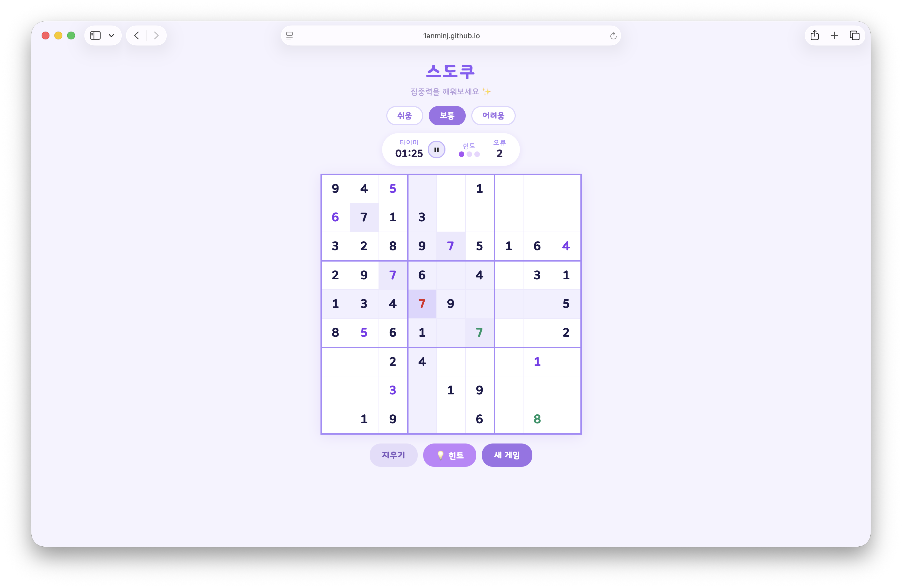

 

# 스도쿠

**집중력을 깨워보세요 ✨**

 

 

 

<!-- 아래 경로에 캡처 이미지를 넣어주세요 -->

  

---

## 기능

|  | 설명 |
|--|------|
| 🎯 **난이도 3단계** | 쉬움 / 보통 / 어려움 |
| ⏱ **타이머** | 일시정지 / 재개 지원 |
| 💡 **힌트** | 게임당 최대 3회 |
| ❌ **오류 카운터** | 틀린 입력 횟수 표시 |
| 🔵 **셀 하이라이트** | 행·열·박스 및 같은 숫자 강조 |
| ⌨️ **키보드 지원** | 숫자 키, 방향키, Delete/Backspace |
| 📱 **모바일 최적화** | 터치 숫자패드 및 반응형 레이아웃 |

---

## 기술 스택

- **HTML / CSS / JavaScript** — 외부 라이브러리 없는 순수 바닐라
- **빙그레 폰트** — 한국어 폰트 직접 임베드
- **GitHub Pages** — 정적 배포
